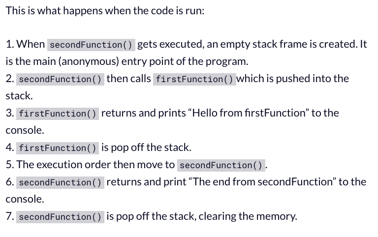

# [CALL STACK](https://developer.mozilla.org/en-US/docs/Glossary/Call_stack)

**Call Stack**:

A mechanism for an interpreter which keeps track of it place within a script that calls multiple function. A function that is currently being run and functions running within the function. When a function is called by a script, it is att by the interpreter to the all stack and then begins to carry out function. Functions call by a function get added further up in call stack and will run when reached. Once the current function is don, interpreter removes it from stack and continues executing code from where it left off. **stack overflow** is an error which occurs if the call stack takes up more space than it was assigned.Call stack is **empty** at first, when a function is invoked it will automatically be added to the stack, once the function is complete, it is removed and stack becomes empty again.

# [Why JS Call Stack is Necessary](https://www.freecodecamp.org/news/understanding-the-javascript-call-stack-861e41ae61d4/)

Call Stack is mostly used for calling functions. Understanding stack and using it is important in order to achieve **asynchronous** programming. Call stack operated by *data structure principle* meaning the first function added to stack will be the first to come out once complete. When *invoked*, a function is temporarily stored with it's parameters and variables which create a **stack frame**. The memory will be cleared once the the function pops out from the stack.

A record is maintained within the stack of *each* stack frame knowing which function will be executed first and will need to be removed. Like standing in line at a grocery store waiting to check out, this is an example on synchronicity and what is meant by **manage function invocation**.

**How the call stack handles function calls**

**stack overflow** is caused by a **recursive function(a self invoked function)**, without exit point. The browser can only support a maximum stack call before it will have to throw back a stack error.

# [JS error messages & debugging](https://codeburst.io/javascript-error-messages-debugging-d23f84f0ae7c)

## Errors

`Uncaught ReferenceError`

- trying to use variables that have not yet been declared. 

- occurs often when using **const** and **let**, there is time between *hoisting* and being *declared*. This is know as **Temporal Dead Zone (TDZ)**

`Uncaught SyntaxError`

- check the syntax, check your semicolons and commas etc.

`Uncaught RangeError`

- occurs when trying to change an object with a certain length and giving it an invalid length

`Uncaught TypeError`

- When JS  can't access a property or method because it has yet to be declare so then it shows as *undefined*

### Debugging

- `console.log()`

- add a **debugger statement** within code

- right click previous breakpoint so running will halt at certain point once/if condition is met

- make a *debug* tab inside VSCode

- Use a combination of debugging methods with **call stack.** This is best if function have names to them so that you can refer to them.

- use **try...catch** to default back to an ideal state if/when an error occurs.
